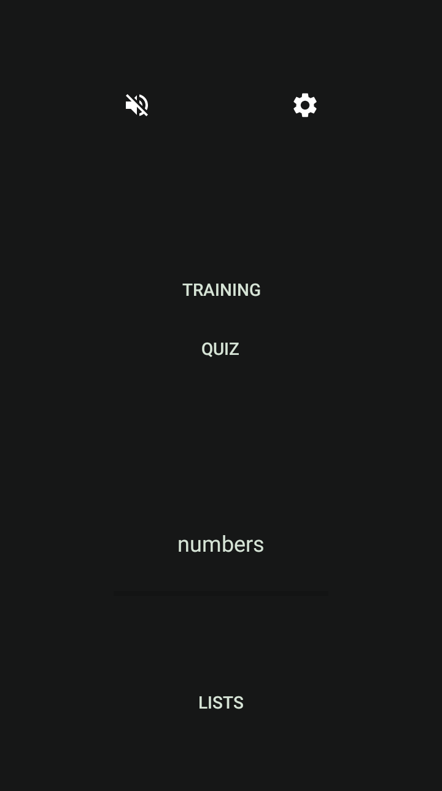
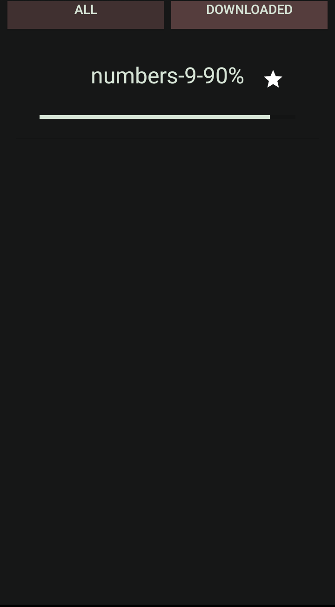

# Sequential

---

Sequential is a vocabulary memorization and practice application on Android platform.
Sequential traces your progress and success rate over the lists.
Tha application needs internet connection to take lists from server, 
it also offers to download lists in local in order to display them in offline mode.

Tha app consist of mainly two main parts
- Practice: Vocabularies in the list are sequentially displayed on the screen with typing effect.
- Quiz: It makes test with vocabularies in the list.

<h3>Projects</h3>
<ul>
<li>
<h4><a href="sequential-server">sequential-server</a></h4>
It is rest api project of Sequential. It provides vocabulary list and information api endpoints.
/list -> gets information of all lists
/list/{list_name} -> gets vocabularies of list by given list name
</li>
<h4><a href="sequential-android">sequential-android</a></h4>
It is Android application of Sequential. It uses api endpoint to take lists and inforamtion from server.
</ul>

